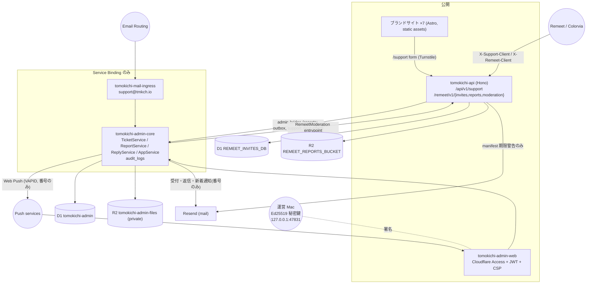

# Architecture — Tomokichi Studio (tmkch.io)

最終更新: 2026-09-21。コードと `wrangler.jsonc` で確認。詳細は各所に既にある文書（`README.md`、`apps/admin-core/README.md`、`docs/operations-tickets.md`、`docs/admin-report-workflow.md`、`docs/app-brand-sites.md`）へリンクする。

## 1. System overview

Tomokichi Studio は「小さなアプリの集まり」を 1 つの monorepo で持つ。中身は 3 種類。

| 種類 | Worker | 何であるか |
|---|---|---|
| **ブランドサイト**（Astro 静的） | `tomokichi-main`（tmkch.io）、`tomokichi-remeet`、`tomokichi-tripory`、`tomokichi-colorvia`、`tomokichi-yohaku`、`tomokichi-quiet-solitaire`、`review` | 各アプリの LP・法務文書・FAQ・更新情報。`packages/app-site` の共通シェル |
| **公開 API**（Hono） | `tomokichi-api`（api.tmkch.io） | お問い合わせ、Remeet の招待・通報・モデレーション manifest |
| **管理基盤**（Admin） | `tomokichi-admin-web`（admin.tmkch.io）、`tomokichi-admin-core`（非公開）、`tomokichi-mail-ingress`（非公開） | Ticket（問い合わせ・通報・障害）、返信、モデレーション、アプリ台帳 |



## 2. Components

| パス | 役割 | 主なファイル |
|---|---|---|
| `apps/main`, `apps/remeet`, … | ブランドサイト | `astro.config.mjs`（`seoAssets()`）、`src/pages/**` |
| `packages/app-site` | 共通シェル・SEO・構造化データ・AI クローラ方針 | `AppSiteShell.astro`, `AppHeroChrome.astro`, `src/seo.ts` |
| `apps/api` | 公開 API | `src/index.ts`（route 登録 + cron + `RemeetModeration` entrypoint）、`routes/support.ts`、`routes/remeet/{invites,reports,moderation}.ts`、`services/admin-bridge.ts`、`services/remeet/*`、`scripts/moderation.ts`（Mac 署名 CLI） |
| `apps/admin-core` | D1/R2 と全ドメイン規則 | `src/index.ts`（`AdminCore` RPC）、`domain/{ticket,report,reply,support,app,dashboard}-service.ts`、`db/*`（repository）、`migrations/0001〜0008` |
| `apps/admin-web` | 公開面。JWT 検証 + セキュリティヘッダ + `/api/*` | `worker/{index,identity,access,security}.ts`、`worker/routes/api.ts`、`client/pages/*` |
| `apps/mail-ingress` | 受信メール → Core → 転送 | `src/index.ts`、`parse.ts` |
| `packages/admin-contracts` | 境界そのもの: 型・zod・`AdminCoreApi`・エラー語彙 | `core.ts`, `tickets.ts`, `reports.ts`, `support.ts`, `reply.ts`, `apps.ts` |
| `packages/admin-mail` | `MailProvider`（Resend / unconfigured）、HTML テンプレ | `mail.ts`, `html.ts` |
| `packages/admin-push` | Web Push（RFC 8291 aes128gcm + RFC 8292 VAPID）を Web Crypto だけで | `encrypt.ts`, `vapid.ts`, `send.ts` |

## 3. Dependencies（方向）

```
apps/admin-web ─┐
apps/api ───────┼─▶ packages/admin-contracts ◀─ apps/admin-core ─▶ packages/admin-mail
apps/mail-ingress ┘         (types + zod)            (D1, R2, rules)
apps/<brand> ──▶ packages/app-site
```

- 呼び出し側（web / api / ingress）は **contracts しか知らない**。D1 スキーマは Core の中だけ。
- Core は route も workers.dev も持たない。到達手段は Service Binding のみ。
- Access の JWT は admin-web が検証し、Core には `ActorRef { type, id: sub }` だけを渡す。

## 4. Data flow（代表 3 本）

**お問い合わせ**: サイト `/support`（Turnstile）または アプリ（client key）→ `api /api/v1/support` → `admin-bridge` で Core に保存（これが受付。Core 不達なら 502）→ `support_threads` → trigger → `tickets(INQUIRY)` → Core `NotificationService` が Ticket 番号だけをメール / Web Push で通知（`support-notifications.md`）。

**通報**: Remeet → `api /remeet/v1/reports`（rate limit、client key、`external_report_id` で冪等）→ R2 に証跡 → outbox → Core `reports`（+ `support_threads` と受付メール）→ trigger → `tickets(REPORT, moderation)` → 運営へ番号だけの通知。本文入りの運営メールは廃止。運営が「削除 / 対応なし」→ Core が操作案 → Mac が署名 → api が manifest 公開 → Core が状態更新。

**返信**: admin-web `/api/support/threads/:id/reply` → Core `ReplyService`（Message-ID / In-Reply-To / References、署名挿入、冪等キー）→ Resend → `support_reply_sends` → trigger → `ticket_messages` / `ticket_events`。受信は `mail-ingress` が `support@tmkch.io` を受け、Core が Message-ID / References / 件名の通報 ID / 送信者で既存スレッドへ繋ぐ。

## 5. Major domains

| ドメイン | 中心 | 文書 |
|---|---|---|
| Ticket（統合キュー、SLA、関連、統合） | `TicketService`, `tickets*` 表 | `operations-tickets.md` |
| Report（通報、証跡、署名付き対応） | `ReportService`, `reports*`, `report_operations` | `admin-report-workflow.md` |
| Support / Reply（スレッド、下書き、テンプレ、署名） | `SupportService`, `ReplyService` | `admin-core/README.md` |
| Apps（台帳、リンク、メール設定） | `AppService`, `apps*` | 同上 |
| Audit | `AuditRepository`（`audit_logs`）+ `ticket_events` | `audit/tomokichi-studio-platform-audit.md` §8 |
| Remeet 招待 | `services/remeet/invite-*` | Remeet リポジトリ `docs/invite-flow.md` |
| Remeet モデレーション | `services/remeet/moderation-*`, `scripts/moderation.ts` | Remeet `docs/moderation-plan.md`、本リポジトリ `admin-report-workflow.md` |
| ブランドサイト | `packages/app-site` | `app-brand-sites.md` |

## 6. Persistence

- **D1 `tomokichi-admin`**（Core）: `migrations/0001〜0008`、forward-only、UUID + ISO 文字列、`audit_logs` は変更と同一 batch。統合 Ticket は legacy 表からトリガで同期（`0006`）。
- **D1 `REMEET_INVITES_DB`**（api）: `migrations/0001〜0009`。招待、通報、モデレーション決定。
- **R2**: `tomokichi-admin-files`（Core、private、証跡に `expired_at`）、`REMEET_REPORTS_BUCKET`（api）。
- ローカル: `wrangler dev` の Miniflare。テストは `cloudflare:test` の D1 に実 migration。

## 7. External services

| 先 | 用途 | 秘密 |
|---|---|---|
| Cloudflare Access | admin.tmkch.io の認証 | `ACCESS_AUD` / `ACCESS_TEAM_DOMAIN` は vars |
| Cloudflare Turnstile | Web の support フォーム | `TURNSTILE_SECRET_KEY`（api）、site key は repository variable |
| Cloudflare Rate Limiting | 公開 API 6 経路 | binding |
| Cloudflare Email Routing | `support@tmkch.io` → `mail-ingress` | `SUPPORT_FORWARD_EMAIL` |
| Resend | 送信（受付・返信・新着通知・manifest 期限警告） | `RESEND_API_KEY`（api）、`MAIL_API_KEY` + `NOTIFICATION_EMAIL`（Core） |
| Web Push services（FCM / APNs / Mozilla） | 新着 Ticket の Push 通知 | `VAPID_PRIVATE_KEY`（Core secret）、`VAPID_PUBLIC_KEY` は var |
| 運営 Mac の署名サービス | モデレーション manifest の Ed25519 署名 | Keychain。Worker には公開鍵のみ |
| App Store Connect（MCP） | リリース同期・審査 | 別リポジトリ（Remeet） |

## 8. CI / Deploy

`ci.yml`（path filter で変更アプリのみ検査）→ 成功後 `deploy.yml`（`workflow_run`、`affected-apps` artifact を読み、Core → Web / Ingress の順）。手動は `Deploy → Run workflow`。`CLOUDFLARE_DEPLOY_ENABLED` で無効化。詳細は [RELEASE.md](RELEASE.md)。
