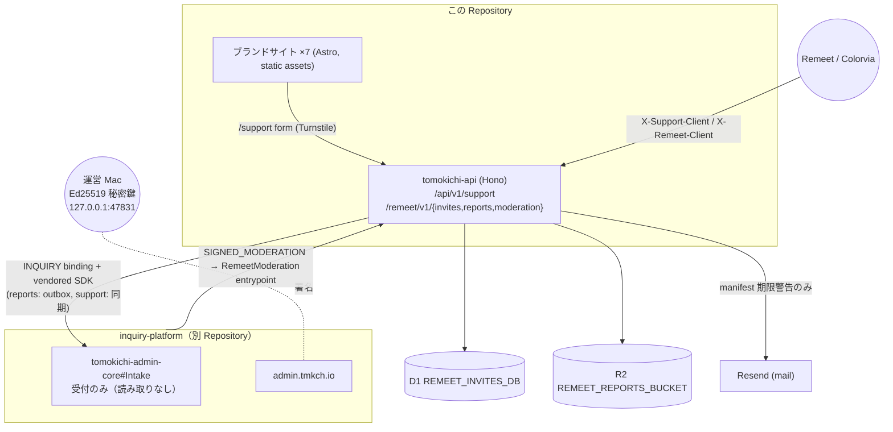

# Architecture — Tomokichi Studio (tmkch.io)

最終更新: 2026-09-26。コードと `wrangler.jsonc` で確認。詳細は各所に既にある文書（`README.md`、`docs/app-brand-sites.md`）へリンクする。

## 1. System overview

Tomokichi Studio は「小さなアプリの集まり」を 1 つの monorepo で持つ。この Repository にあるのは 2 種類。

| 種類 | Worker | 何であるか |
|---|---|---|
| **ブランドサイト**（Astro 静的） | `tomokichi-main`（tmkch.io）、`tomokichi-remeet`、`tomokichi-tripory`、`tomokichi-colorvia`、`tomokichi-yohaku`、`tomokichi-quiet-solitaire`、`review` | 各アプリの LP・法務文書・FAQ・更新情報。`packages/app-site` の共通シェル |
| **公開 API**（Hono） | `tomokichi-api`（api.tmkch.io） | お問い合わせ・通報の受付口、Remeet の招待・モデレーション manifest |

お問い合わせ・通報・返信・通知・管理画面（`admin.tmkch.io`）は **問い合わせ基盤 [tomoki013/inquiry-platform](https://github.com/tomoki013/inquiry-platform)**（private）にあり、Worker `tomokichi-admin-core` / `tomokichi-admin-web` / `tomokichi-mail-ingress` もそこからデプロイする（ADR-022）。Tomokichi Studio は基盤を使う Project の 1 つ。



## 2. Components

| パス | 役割 | 主なファイル |
|---|---|---|
| `apps/main`, `apps/remeet`, … | ブランドサイト | `astro.config.mjs`（`seoAssets()`）、`src/pages/**` |
| `packages/app-site` | 共通シェル・SEO・構造化データ・AI クローラ方針 | `AppSiteShell.astro`, `AppHeroChrome.astro`, `src/seo.ts` |
| `apps/api` | 公開 API | `src/index.ts`（route 登録 + cron + `RemeetModeration` entrypoint）、`routes/support.ts`、`routes/remeet/{invites,reports,moderation}.ts`、`services/admin-bridge.ts`（基盤への受け渡し）、`services/remeet/*`、`scripts/moderation.ts`（Mac 署名 CLI） |
| `packages/inquiry-sdk` | 問い合わせ基盤の SDK（vendored、依存ゼロ）。編集しない | `VENDORED.md` にコピー元コミット |

## 3. Dependencies（方向）

```
apps/api ──▶ packages/inquiry-sdk ──(Service Binding: Intake)──▶ inquiry-platform
apps/<brand> ──▶ packages/app-site
```

- `apps/api` は基盤の SDK の型しか知らない。基盤の D1 スキーマも管理用の RPC も知らない。
- `INQUIRY` binding は基盤の `Intake` entrypoint に届き、`props` でこの Worker が登録できる Project（サポートフォームの 9 アプリ + 未割当）が固定されている。`src/inquiry-binding.test.ts` が逸脱を検知する。

## 4. Data flow（代表 2 本）

**お問い合わせ**: サイト `/support`（Turnstile）または アプリ（client key）→ `api /api/v1/support` → `admin-bridge` が `createContact` で基盤に保存（これが受付。不達なら 502）。以降（Ticket 化、運営への番号だけの通知、返信）は基盤側。

**通報**: Remeet → `api /remeet/v1/reports`（rate limit、client key、`reportId` で冪等）→ R2 に証跡 → outbox → `createReport` / `attachReportEvidence` で基盤へ（5 分 cron で再送）。運営が「削除 / 対応なし」を選ぶと、基盤が `RemeetModeration` entrypoint に操作案を求め → Mac が署名 → api が manifest 公開 → 基盤が状態更新。

## 5. Major domains

| ドメイン | 中心 | 文書 |
|---|---|---|
| 問い合わせ・通報・返信・通知・監査 | inquiry-platform | 同 Repository `docs/` |
| Remeet 招待 | `services/remeet/invite-*` | Remeet リポジトリ `docs/invite-flow.md` |
| Remeet モデレーション | `services/remeet/moderation-*`, `scripts/moderation.ts` | Remeet `docs/moderation-plan.md`、inquiry-platform `docs/operations/report-workflow.md` |
| ブランドサイト | `packages/app-site` | `app-brand-sites.md` |

## 6. Persistence

- **D1 `REMEET_INVITES_DB`**（api）: `migrations/0001〜0009`。招待、通報、モデレーション決定。
- **R2 `REMEET_REPORTS_BUCKET`**（api）: 通報の証跡と outbox。
- 基盤の D1 `tomokichi-admin` / R2 `tomokichi-admin-files` は inquiry-platform が管理する。
- ローカル: `wrangler dev` の Miniflare。テストは `cloudflare:test` の D1 に実 migration。

## 7. External services

| 先 | 用途 | 秘密 |
|---|---|---|
| Cloudflare Turnstile | Web の support フォーム | `TURNSTILE_SECRET_KEY`（api）、site key は repository variable |
| Cloudflare Rate Limiting | 公開 API 6 経路 | binding |
| Resend | manifest 期限警告 | `RESEND_API_KEY`（api） |
| 運営 Mac の署名サービス | モデレーション manifest の Ed25519 署名 | Keychain。Worker には公開鍵のみ |
| App Store Connect（MCP） | リリース同期・審査 | 別リポジトリ（Remeet） |

Access・Email Routing・受付/返信/新着通知のメール・Web Push は基盤側（inquiry-platform `docs/security/overview.md`）。

## 8. CI / Deploy

`ci.yml`（path filter で変更アプリのみ検査）→ 成功後 `deploy.yml`（`workflow_run`、`affected-apps` artifact を読んでデプロイ）。手動は `Deploy → Run workflow`。`CLOUDFLARE_DEPLOY_ENABLED` で無効化。基盤の 3 Worker はこの workflow に含まれない。詳細は [RELEASE.md](RELEASE.md)。
